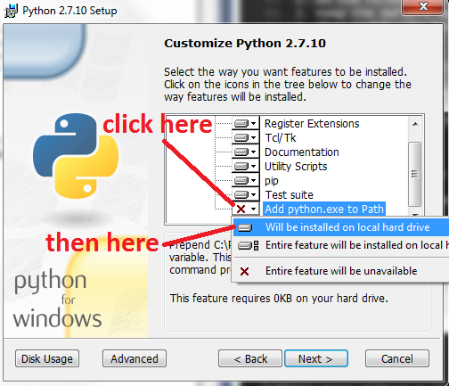
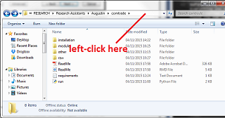
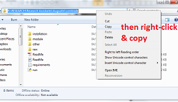
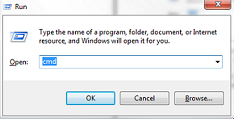
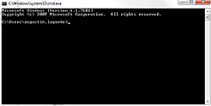
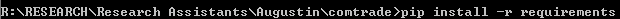

\newpage

# Introduction

## Why some Python scripts?

For the purpose of analysing the exports (only) in commodities and services around the world, we wanted to use data from the [UN ComTrade Database](http://comtrade.un.org/) and [UN ServiceTrade Database](http://unstats.un.org/unsd/servicetrade/). One can also use the [WTO data](http://stat.wto.org/) but the commodity classification provides only 17 groups while at the most agreggated level (AG2) ComTrade provides easily 107 categories or even more at the 4-digit (AG4) and 6-digit (AG6) levels. 

Anyway, product data are generally sourced from UNSD Comtrade and Eurostat. And service data are jointly produced by the WTO and UNCTAD.

Because of access restrictions of the ComTrade database, we have developped a script that will optimize your downloads and make the best-use of your time. For the service data you can download the whole dataset at once.

## Why this app?

Not everyone is familiar with Python programming, this application is trying to be as user-friendly as possible and does not need any pre-requirements in Python to be used.

## What does it do?

* It can collect export data from the UN ComTrade API
* It can clean data download from the UN ServiceTrade website
* It can aggregate the commodity data into yearly databases
* It can aggregate the yearly databases into into one single database
* It can prepare the data for the Principal Component Analysis in R (or any statistical software of your choice)

## Is it perfect?

Of course not. Be aware when you use it that it is a tremendous amount of work on my own and I might have forgotten some mistakes around. Also if you do something unanticipated, the program will most often crash or at best provide the wrong outcome. So be careful and try to understand how it works a bit before trying randomly to use it.

\newpage

# Installation of Python and the required packages

Before being able to use this program, the user will have to install Python 2.7. Everything you will need has already been downloaded for you and is stored in the folder called "installation" inside the "comtrade" folder (where you should have found the PDF you are reading right now). If the appropriate version of Python is already installed on you computer you can skip the first part, otherwise, here are all the steps to follow:

## How to I install Python 2.7?

1. On the folder "installation", run "python-2.7.10"
2. Keep the default options until you reach the screen "Customize Python 2.7.10"
3. Then modify the last option. Click **Add python.exe to Path** and select **Will be installed on local hard drive**. That should be something like:
    

4. On the folder "installation", you will also find "VCForPython27"
5. Install it. It is a Visual C++ Interpreter for Python 2.7. You don't really need to know what it does but without it you will not be able to do the next step.

\newpage

## How do install the packages needed to run the application?

6. Go back to the root folder of 'comtrade' and **copy its path**. It should look like:

7. You will now need to open the **Command Prompt** (you know this black window on the picture below) to do so:
    + Press [WinKey] + [R] (*Hint: the Winkey is the key with the windows sign on the keyboard*)
    + Write "cmd"
    + Press [Enter]. It should look like that:

 >> then >>

8. In this command prompt, do the following (look at the picture below for help):
    + Write the letter of the drive where the 'comtrade' folder is stored followed by a colon (In my case it is "R:")
    + Press [Enter]
    + Write "cd", [space] and right-click on the prompt to paste the path copied earlier (*Hint: Ctrl+V doesn't work in the prompt*)
    + Press [Enter]. Like that:

9. Now you will run the script that will download the packages for you:
    + Input "pip install -r requirements.txt"
    + Press [Enter]. It should look like that:
    

    
It will install a bunch of stuff. Don't worry if it is long. **It will take approximately 7 minutes** to install everything. After that, you will be all set to open the program. 

\newpage

# Running the application

On the root of the 'comtrade' folder, just double-click on 'run.py'. The application will start.

## Option 1: download from UN ComTrade

First, the function will ask you which classification of commodities you want to use. Meaning the number of digit this classification should include:

* AG2: Aggregated level with 2-digit code (107 categories)
* AG4: Aggregated level with 4-digit code (1304 categories)
* AG6: Aggregated level with 6-digit code (approximately 5300 article/product descriptions)

This function will ask you which year you want to download. It downloads the aggregate exports of a country divided in commodity group using the  classification code chosen (AG2, AG4 or AG6) for all the reporters where data is available. You will find the files in the folder 'dl' under 'data' and under AG2, AG4 or AG6 depending of the selection.

The files name are formatted like that:

> 'comtrade_EXtoWorld_FRA_2007'

* comtrade: the source of the file UN ComTrade
* ExtoWorld: Indicate that this files contains the aggregate export to the world and not bilateral information.
* FRA: the ISO code of the country.
* 2007: the year

Be aware, that each year requires approximately **2 hours 20 minutes to be downloaded**.

Also some request just create a file with no data, the script automatically erase those files and keep track of them of a file in the folder 'dl_reports' under 'data' and 'dl'. There is one file per download, so one file per year and per classification and each reports contains which downloaded files have been deleted.

Note: As far as we have observed the empty files are due to absence of data for the country and the year selected. We did not identify any other reason. Anyway the reports created could be used to check if those countries are needed/relevant for the analysis or not.

## Option 2: concatenate files from a specific year (request step 1 first)

Select the year and classification level. It will create an aggregated file under 'data', 'yearly' and the selected aggregated level.

## Option 3: to merge several years together (request step 2 first)

Select the aggregated level wanted. It will aggregated all the year already aggregated for this classification level into one database under 'data', 'database'.

## Option 4: download from UN ServiceTrade

The only way to obtain data from the UN ServiceTrade is to go through their website and download it manually. Go to [the UN ServiceTrade website](http://unstats.un.org/unsd/servicetrade/). You need to register. On the website; you will access the data with 'Express Selection' under 'Data Query'.

For the PCA analysis we will need:

* all the service codes [leave the box empty]
* all the reporters [leave the box empty]
* World as partner [enter "0" for partner]
* all available years [leave the box empty]
* data on exports [tick "Export"]

This little function will ask you where is the file you downloaded from UN Service Trade. It will create a copy inside the program available-files-folder which is under the 'service' folder under 'raw'. 

## Option 5: perform the PCA analysis

[This option has been abandonned as the implementation of PCA in R is more often used as is the lasso regression model that we wanted to use for our analysis]

## Option 6: exit programme

Simply exit the program.

# Limitations and specifications in the code

Due to download limitations the ComTrade allow you to extract as follow:

- Year: 2000 - 2014
- Trade Flow : Export
- Reporter : All
- Partner : World
- Commodities : AG2, AG4, AG6

